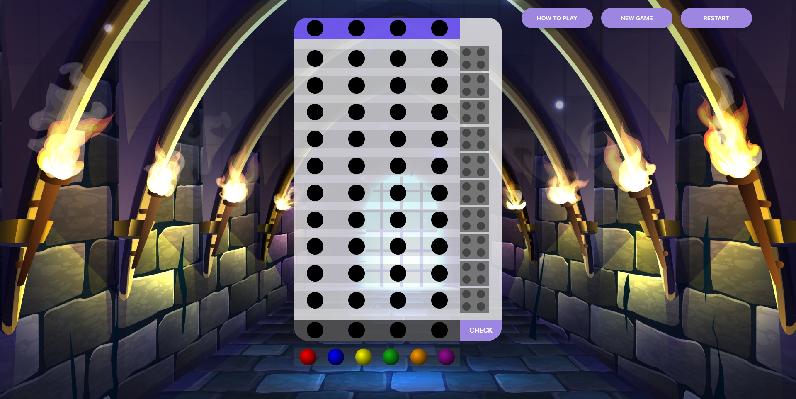
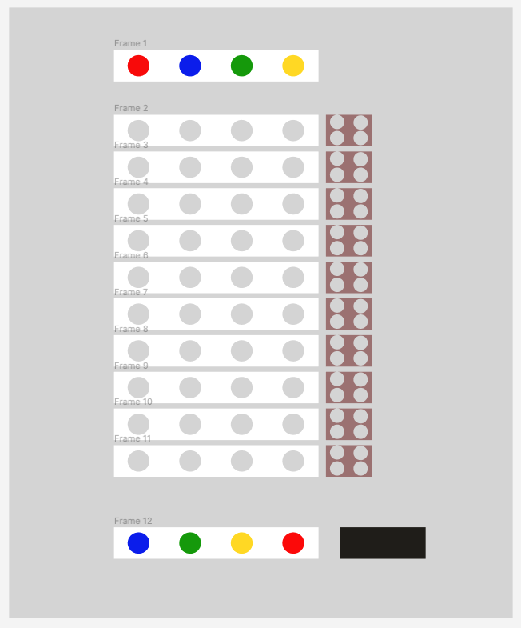

# Mastermind Game

#### A site built from top to bottom as my first website project. 

## Description
The "Castle of Codes" is a digital adaptation of the classic board game, Mastermind, where your goal is to crack a hidden color code within a limited number of tries. Put your logical thinking and deduction abilities to the test in this entertaining game.

## Table of Contents
* [Technologies Used](#technologiesused)
* [Features](#features)
* [Design](#design)
* [Project Next Steps](#nextsteps)
* [Deployed App](#deployment)
* [About the Author](#author)

## Technologies Used
* JavaScript
* HTML5
* CSS3

## Features
* The computer generates a secret code.
* You attempt to guess the code within a limited number of turns.
* Black pegs indicate correct color and position.
* White pegs indicate correct color but wrong positio.

## Whiteboard Images
*Original Whiteboard sketch

## Trello Planning
* All planning in Trello.

## Design
* Design elements implemented using HTML5 and CSS3. 

## Project Next Steps
* Allow users to customize the number of pegs for the secret code, providing more flexibility in board size.
* Implement responsive design with Media Queries.
* Introduce a scoring system and the ability to play multiple rounds.
* Work on incorporating multiplayer features, enabling players to compete or collaborate with others.

## Deployed Link
[Netlify](https://karolbgm.github.io/mastermind-project/)

* You can view the repository:
[Github.com](https://github.com/Gr8ness21/joosPodcast)
* If unable to view please go live locally through VS Code
    
## Works Cited:
* N/A

## About The Author
I am a passionate software engineer with a flair for transformation. In my previous career as a chemical engineer and administrative assistant I honed my adaptability and attention to detail to solve problems. I orchestrate efficiency in any role I take on and as a Full Stack Software Engineer, I blend creativity and precision to build digital solutions that bridge borders and cultures.